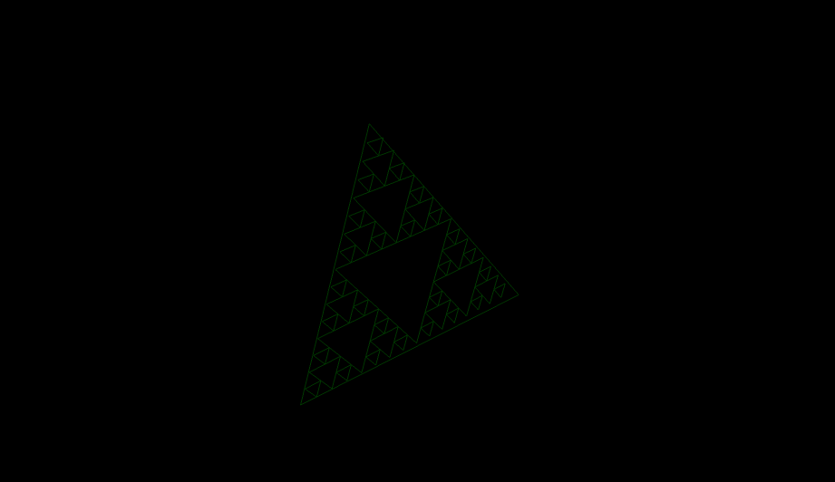
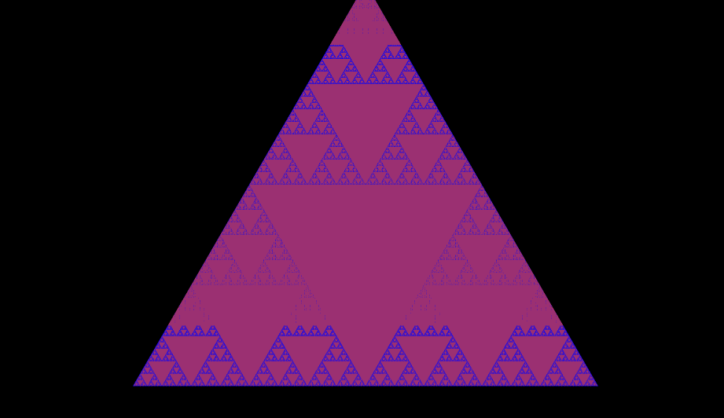

# ◤ Trikona ◥

This is a simple project to tinker with low-level graphics in haskell using OpenGL. As of now, launching the program creates a Sierpinski triangle which can be moved with the arrow keys, rotated with "w", "a", "s", "d", and zoomed in/out with the "j" and "k" keys.

You can change the number of iterations of the Sierpinski triangle in the main file (./lib.hs)

I initially chose Sierpinski triangles since I thought the recursive structure would lend itself to an elegant solution in a functional language like haskell.

## Dependencies

This project was written using macOS 13.14.1 and compiled using the Glorious Glasgow Haskell Compilation System (GHC), version 9.2.8. To build the file you need [stack](https://docs.haskellstack.org/en/stable/install_and_upgrade/).

## Quickstart

You can build the file by running the following command at the root of this repo:  
` stack build Trikona`

After building, you can launch the executable by running `stack exec Trikona-exe`

## Contributing

Any contributions are greatly appreciated! Feel free to open up a PR to address any of the following (in no particular order of importance):

- Making the program more performant - currently there is a memory leak which causes the program to crash after some time from launch
- Adding higher dimension triangles - It would be cool to have 3-d triangles (pyramids) or even 4-d triangles (tesseracts)!
- Making settings more configurable - Currently things like the shader sources and the number of fractal iterations need to be directly modified in the source code. It would be nice to have these be configurable from the command line.
- Anything else you can come up with!

## Acknowledgements

This project was started during my Summer 2 '23 batch at the [Recurse Center](https://www.recurse.com). Thank you to everyone in the community for providing a supportive and encouraging space for such a diverse collection of programmers.
